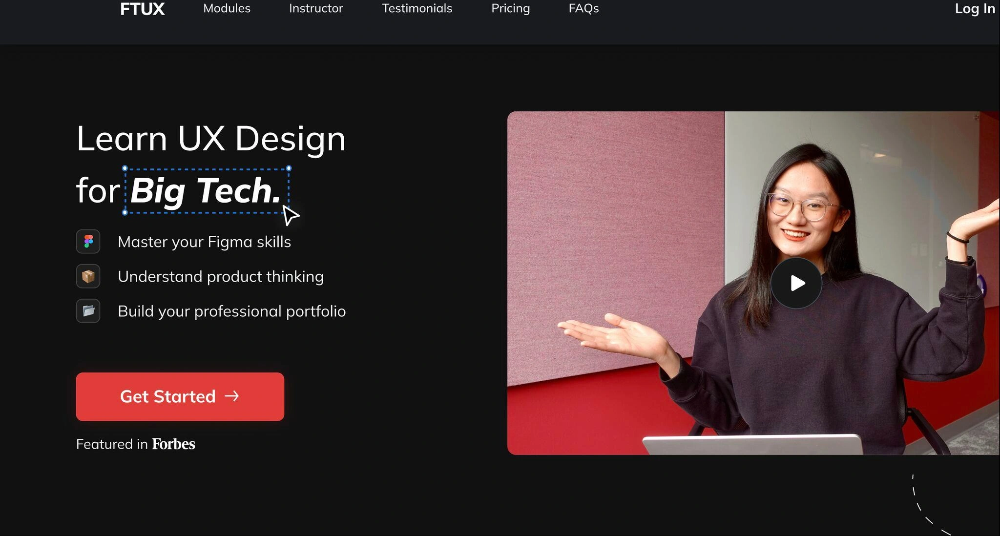

# QA Report — Precious Okoro Portfolio
**Date:** 2026-07-10
**Scope:** index.html, about.html, work.html, experience.html, contact.html, assets/style.css, assets/main.js, images/
**Tracks:** Code QA (bugs, accessibility, CSS hygiene) + Content QA (copy, IA consistency)

This supersedes the 2026-07-08 report. That report's two critical findings — WCAG contrast failures on amber/mint text, and a dead "Download CV" link — have both been fixed and are verified resolved below. This pass covers what's changed since (color-block redesign, card component rework) plus a full re-check.

---

## 🔴 Critical Issues

### 1. "Case study visuals coming soon" overlays the real FastTrackUX screenshot
On both `index.html` and `work.html`, the FastTrackUX project card renders a real, fully-loaded image with a placeholder label stacked directly on top of it:

```html
<div class="project-media image-block">
  
  <div class="image-block-label">Case study visuals coming soon</div>
</div>
```

Verified via computed geometry, not just code inspection: the image renders at 2048px natural width (`complete: true`), and the label's bounding box (765–1012px × 1421–1479px) sits entirely inside the image's bounding box (653–1124px × 1291–1609px) — full overlap, not a partial/edge overlap. The `.image-block-label` isn't conditional on load failure; it's a permanent sibling that CSS (`position: relative` inside a `display: flex` container, with the `` set to `position: absolute; inset: 0`) centers on top of the image.

This also affects screen readers: the FastTrackUX card's accessible name literally reads *"FastTrackUX landing page redesign Case study visuals coming soon EDTECH · 2024 FastTrackUX..."* — assistive-tech users get the same false "not ready yet" signal sighted users do.

The Moniger card doesn't have this problem — its label was already removed when the real image was added. FastTrackUX's was missed in that same pass.

**Fix:** delete the `<div class="image-block-label">Case study visuals coming soon</div>` line from the FastTrackUX card in both `index.html` and `work.html` (2 occurrences total). Keep the `image-block-label` CSS and the `onerror` fallback — they're still correct for genuinely-missing images (e.g. the About page headshot, which still shows "Add headshot" placeholder text as intended).

---

## 🟡 Improvements

### 2. Identical date ranges for two different jobs on experience.html
`Moniger` ("Content Design & Strategy Lead") and `Babelos` ("Content Strategist") both list **Jan 2022 – Feb 2026** — byte-identical start and end months for two different companies ([experience.html:67](experience.html:67), [experience.html:79](experience.html:79)). Could be legitimate overlapping freelance work, but identical-to-the-month dates for two different employers reads as a copy-paste artifact to anyone reviewing closely (a recruiter, a hiring manager). Worth a quick sanity check against the real dates — even a one-month offset would remove the "did they forget to update this" impression.

### 3. Job title inconsistency for the same Moniger engagement across pages
`experience.html:69` calls it **"Content Design & Strategy Lead."** `work.html:63`'s case study calls the same role **"Lead Content Designer & UX Content Strategist."** Same job, two different titles depending which page a visitor lands on — pick one and use it in both places.

### 4. work.html's page intro breaks the site's IA pattern
Every other page opens with `<div class="section-label">` — a mono-font label plus a divider line (`.section-label::after`). `work.html:49` uses `<div class="eyebrow">AI / UX Content Strategy</div>` instead, which has no divider and different type styling. Minor, but noticeable in an otherwise consistent pattern across 5 pages — a visitor moving from Home → Work sees the section-intro convention change for no apparent reason.

**Fix:** swap the `eyebrow` div at work.html:49 for the standard `section-label` markup used on the other four pages, or fold the "AI / UX Content Strategy" text into the existing label pattern.

---

## 🟢 Suggestions

### 5. Dead CSS: `.insight-box`, `.insight-label`, `.insight-quote`, `.tools-list`
These four rules ([style.css:398-416](assets/style.css:398), [style.css:462-468](assets/style.css:462)) have no matching class in any of the 5 HTML pages — confirmed via grep across all files. Likely leftovers from an earlier design iteration (the tools section now uses `.tools-logos`/`.tool-logo` with icon images, not the text-based `.tools-list` with separators). Safe to delete if not planned for reuse.

### 6. Unused image asset in `images/`
`images/71B58384-5806-4753-89FD-4CA1E78C632D_1_105_c.jpeg` isn't referenced by any `` tag or CSS `url()` across the site (confirmed: only `fasttrackux-cover.webp`, `moniger-cover.png`, `moniger-hero.png`, and `precious-headshot.jpg` are actually used). Looks like a stray export — worth deleting or confirming it's needed for a future page.

### 7. Empty `cv/` folder
The old dead-CV-link bug was fixed by pointing "Download CV" at a Google Drive share link instead ([index.html:266](index.html:266), [experience.html:124](experience.html:124)) — good fix, works correctly. But the now-unused `cv/` folder is still sitting in the project root. Harmless, but worth removing so a future editor doesn't wonder whether it's supposed to be populated.

### 8. Hover-only affordance on contact links has no focus-visible pairing
`.contact-list a::after` shows a `→` arrow on `:hover` only ([style.css](assets/style.css) — contact-list rules). Keyboard users tabbing through the contact list still get the global `:focus-visible` outline, so they're not stranded, but they don't get the arrow flourish sighted mouse users see. Minor polish gap, not a blocker — add `:focus-visible` alongside `:hover` on that selector for full parity.

---

## ✅ Verified Fixed Since Last Report

- **Contrast failures resolved.** `--ink-faint` was darkened from `#8A8172` (3.44:1) to `#6B6459`; text-safe variants (`--accent-amber-text: #8C5E0C`, `--accent-mint-text: #0E7A50`, plus coral/sky equivalents) now exist and are correctly wired into `.col-approach h4`, `.col-outcome h4`, and `.text-highlight.amber/.mint` — all pass WCAG AA (~5:1 on `--paper`). Raw `--accent-amber`/`--accent-mint` are still used, but only for decorative dots, borders, and backgrounds, matching their documented "decorative only" intent in the CSS comments.
- **Dead CV link fixed.** All "Download CV" buttons now point to a live Google Drive link instead of the nonexistent local `cv/precious-okoro-cv.pdf`.
- **No broken image references.** All 4 actively-referenced images (`fasttrackux-cover.webp`, `moniger-cover.png`, `moniger-hero.png`, `precious-headshot.jpg`) exist in `images/`.
- **No console errors or failed network requests** on page load (checked via dev server on port 4173).
- **Mobile nav works correctly.** `.nav-toggle` correctly toggles `aria-expanded` and reveals `.nav-mobile-panel` (verified via click + computed style, at 375×812 viewport). Card grids collapse to single-column on mobile as expected.
- **`main.js` is clean** — 17 lines, single responsibility (mobile nav toggle), no bugs.
- **Touch targets meet the 44×44px guideline** (`.nav-toggle`).

---

## Summary
One critical bug remains: the FastTrackUX placeholder label sitting on top of a fully-loaded screenshot, affecting both sighted and screen-reader visitors on two pages. It's a two-line deletion. Everything else is polish — duplicate dates and a title mismatch worth a content sanity-check, one page-intro pattern to align with the rest of the site, and a handful of dead CSS/unused assets to clean up. The contrast and dead-link issues from the last review are confirmed fixed and didn't regress.
